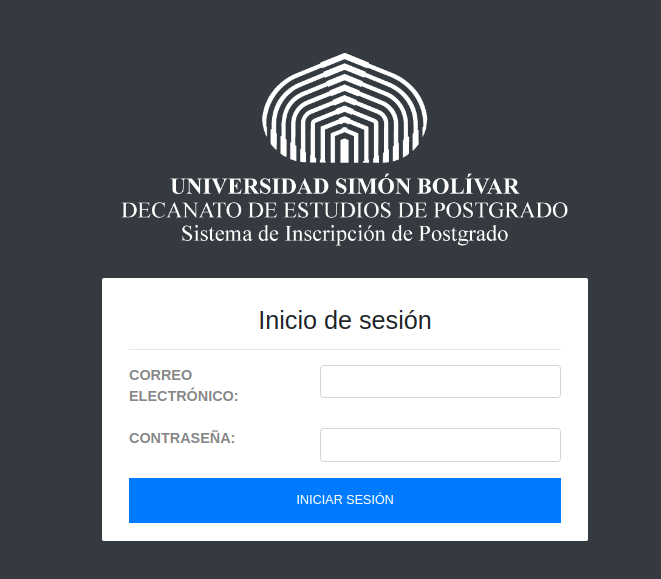
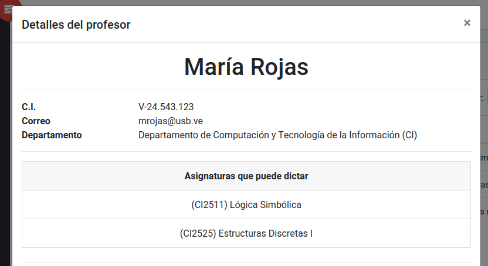

# GUÍA DEL USUARIO

Este documento pretende servir como guía para el uso de la aplicación, de una manera sencilla y acompañada de guías visuales, para poder acceder a las diversas funcionalidades presentes. El documento se encuentra en constante actualización en el proceso de desarrollo del Sistema de Inscripción de Postgrado, e incluirá una guía de todas las acciones posibles.

Para revisar una documentación más técnica, puedes revisar la [guía del programador](GUIA-PROGRAMADOR.md).

## Login

Al entrar en el link se muestra el login de la aplicacion. Este cuenta con un campo para ingresar el correo electronico del usuario y un campo para su contraseña. Los datos de superusuario del sistema son:

*correo electronico: admin@usb.ve*

*contraseña: 1234abcd*

## Inicio

La sección de inicio de la aplicación muestra la barra de navegación lateral y tres contadores dinámicos de asignaturas, departamentos y profesores, además de mostrar un saludo al usuario en cuestión. Arriba a la derecha, se puede acceder a algunas opciones que trabajarán en un futuro, como perfil y cierre de sesión; sin embargo, ahorita no hacen nada, sirviendo solo de *mock-up* de la interfaz gráfica.

## Gestión de Profesores

El apartado de Gestión de profesores, al que se puede acceder con la barra de navegación lateral, permite realizar operaciones sobre los datos de profesores, como:

- Agregar un profesor nuevo con sus datos respectivos
- Modificar los datos de un profesor existente
- Eliminar un profesor existente
- Listar todos los profesores cargados en sistema
- Realizar búsquedas por cédula, nombre, apellido, código de departamento, nombre de departamento, código de asignatura y/o nombre de asignatura que puden dictar entre los profesores listados
- Ver los detalles de atributos, asignaturas que puede dictar y disponibilidad horaria de un profesor en particular

Todas las operaciones están concentradas en la misma vista.

### Listar profesores

El apartado de listar asignatura es la vista que aparece al momento de seleccionar "Gestionar profesores" en la barra lateral. Los profesores se distribuyen en una tabla dinámica que muestra la cédula, el nombre, el apellido, el departamento asociado y la lista de materias que puede dictar cada profesor. La tabla, en su parte inferior, cuenta con opciones de paginación para ver entre 10 y 100 profesores por página y avanzar entre ellas. En su parte superior, cuenta con un campo de búsqueda dinámico que puede filtrar por todos los campos mostrados con solo empezar a escribir. 

Las acciones posibles en cuanto a gestión de la información son:
- Agregar un profesor, haciendo clic en el botón azul que se encuentra encima de la tabla
- Ver detalles de un profesor, haciendo clic en el ícono de *ojo* en la celda de acciones de ese profesor
- Modificar un profesor, haciendo clic en el ícono de *lápiz* en la celda de acciones de ese profesor
- Eliminar un profesor, haciendo clic en el ícono de *papelera* en la celda de acciones de ese profesor

Esta vista incluye validaciones y mensajes de error o éxito en función del resultado de las acciones de gestión de la información.

### Agregar un profesor

Al hacer clic al botón de agregar un profesor, se puede llenar el formulario de inclusión de los datos de profesores y hacer *envío* del mismo. Los campos de *asignaturas* y *disponibilidades* se muestran como listas desplegables *autocompletables*: se puede empezar a escribir y se filtrarán sus contenidos. Esta vista muestra errores de validación, como cédulas que se repiten.

### Visualizar detalles de profesor

Al hacer clic al ícono de ver un profesor (*ojo*), se puede visualizar la información almacenada de ese profesor en dos secciones. La primera, que se muestra en la imagen superior, lista los datos básicos y la lista de asignaturas que puede dictar un profesor.

Si se sigue revisando el contenido de la ventana emergente (modal), se verá una matriz que incluye la disponibilidad horaria del profesor según sus datos almacenados en el sistema, indicando con un mensaje afirmativo en qué horarios puede dictar asignaturas dentro de la Universidad Simón Bolívar.

### Editar un profesor

Al hacer clic al ícono de editar un profesor (*lápiz*), se puede visualizar el formulario de edición de sus datos y hacer *envío* del mismo. Los campos son los mismos que se muestran en el formulario de *Agregar un profesor* pero vienen pre-llenados con los datos actuales del profesor en cuestión. De igual manera, cuenta con validaciones y muestra los errores en caso de existir.

### Eliminar un profesor

Al hacer clic al ícono de eliminar un profesor (*papelera*), se puede visualizar la ventana de confirmación de eliminación y hacer *confirmación* de la misma. Si se hace clic en el botón rojo, el profesor quedará eliminado del sistema. Si se hace clic en Cerrar o fuera de la ventana modal, se cerrará esta y no ocurrirá ningún cambio en la información.

## Gestión Asignaturas

El apartado de Gestión de asignaturas, al que se puede acceder con la barra de navegación lateral, permite realizar operaciones sobre los datos de asignaturas, como:

- Agregar una asignatura nueva asignatura con sus datos respectivos
- Modificar los datos de una asignatura existente
- Eliminar una asignatura existente
- Listar todas las asignaturas cargadas en sistema
- Realizar búsquedas por nombre, codigo y departamento
- Ver los detalles de atributos, horas de laboratorio, teoria y practica, unidad de credito y requisitos

Todas las operaciones están concentradas en la misma vista

### Listar asignatura

El apartado de listar asignatura es la vista que aparece al momento de seleccionar "Gestionar asignaturas" en la barra lateral. Las asignaturas se distribuyen en la tabla mostrando su codigo, nombre y departamento al que pertenece. La tabla, en su parte inferior, cuenta con opciones de paginación para ver entre 10 y 100 asignaturas por página y avanzar entre ellas. En su parte superior, cuenta con un campo de búsqueda dinámico que puede filtrar por todos los campos mostrados con solo empezar a escribir. 

Las acciones posibles en cuanto a gestión de la información son:
- Agregar una aginatura, haciendo clic en el botón azul que se encuentra encima de la tabla
- Ver detalles de una asignatura, haciendo clic en el ícono de *ojo* en la celda de acciones de esa asignatura
- Modificar una asignatura, haciendo clic en el ícono de *lápiz* en la celda de acciones de esa asignatura
- Eliminar una asignatura, haciendo clic en el ícono de *papelera* en la celda de acciones de esa asignatura

Esta vista incluye validaciones y mensajes de error o éxito en función del resultado de las acciones de gestión de la información.

### Agregar una asignatura

Al hacer clic al botón de agregar una asignatura, se puede llenar el formulario de inclusión de los datos de la asignatura y hacer *envío* del mismo. El campo *Departamento* es una lista desplegables con todos los departamentos existentes dentro del sistema. Los campos de *horas* permiten agregar datos numericos sobre la carga horaria de la asignatura. El campo *Requisitos* carga todas las asignaturas de ese departamento para ser agregadas como requisitos.

### Visualizar detalles de asignatura

Al hacer clic al ícono de ver una asignatura (*ojo*), se puede visualizar la información almacenada de esa asignatura en dos secciones. La primera, muestra los datos de nombre, codigo y departamento. La segunda muestra una tabla con los posibles horarios semanales de la asignatura.

### Editar una asignatura

Al hacer clic al ícono de editar una asignatura (*lápiz*), se puede visualizar el formulario de edición de sus datos y hacer *envío* del mismo. Los campos son los mismos que se muestran en el formulario de *Agregar una aginatura* pero vienen pre-llenados con los datos actuales de la asignatura en cuestión. De igual manera, cuenta con validaciones y muestra los errores en caso de existir.

### Eliminar una asignatura

Al hacer clic al ícono de eliminar una asignatura (*papelera*), se puede visualizar la ventana de confirmación de eliminación y hacer *confirmación* de la misma. Si se hace clic en el botón rojo, la asignatura quedará eliminada del sistema. Si se hace clic en Cerrar o fuera de la ventana modal, se cerrará esta y no ocurrirá ningún cambio en la información.

## Gestión Oferta

El apartado de Gestión de ofertas, al que se puede acceder con la barra de navegación lateral, permite realizar operaciones sobre los datos de ofertas, como:

- Agregar una oferta trimestral nueva con sus datos respectivos (paso 1)
- Agregar una oferta trimestral nueva con sus datos respectivos (paso 2)
- Eliminar una oferta existente
- Listar todas las ofertas cargadas en sistema
- Realizar búsquedas por trimestrey nombre
- Ver los detalles de asignaturas, profesores y preferencias de la oferta trimestral

Todas las operaciones están concentradas en la misma vista

### Listar ofertas

El apartado de listar ofertas es la vista que aparece al momento de seleccionar "Gestionar ofertas" en la barra lateral. Las ofertas se distribuyen en la tabla mostrando su codigo, nombre y departamento al que pertenece. La tabla, en su parte inferior, cuenta con opciones de paginación para ver entre 10 y 100 ofertas por página y avanzar entre ellas. En su parte superior, cuenta con un campo de búsqueda dinámico que puede filtrar por todos los campos mostrados con solo empezar a escribir. 

Las acciones posibles en cuanto a gestión de la información son:
- Agregar una oferta, haciendo clic en el botón azul que se encuentra encima de la tabla
- Ver detalles de una oferta, haciendo clic en el ícono de *ojo* en la celda de acciones de esa oferta trimestral
- Eliminar una oferta, haciendo clic en el ícono de *papelera* en la celda de acciones de esa oferta trimestral

Esta vista incluye validaciones y mensajes de error o éxito en función del resultado de las acciones de gestión de la información.

### Agregar una oferta (parte 1 )

Al hacer clic al botón de agregar una oferta, se puede llenar el formulario de inclusión de los datos de la oferta y hacer *Continuar* del mismo. El campo *Asignaturas* es una lista desplegables con todas las asignaturas de un departamento existentes dentro del sistema. Los campos de *trimestre* y *año* permiten formar el nombre UNICO de la oferta trimestral, trimestre permite elegir entre cuatro opciones las cuales representan los periodos de clases anuales y año es un numero entero para elegir el año donde se dicta la oferta trimestral.

### Agregar una oferta (parte 2 )

Al hacer clic al botón de Continuar, se desplegara una pantalla en donde aparecen las asignaturas seleccionadas en la pantalla anterior y al lado de cada una, una lista con los profesores en capacidad de dictar la materia, se seleccionan los candidatos y se procede a darle agregar para crear la oferta. A los profesores seleccionados les llegara un correo anunciando su seleccion.

### Visualizar detalles de oferta

Al hacer clic al ícono de ver una oferta (*ojo*), se puede visualizar la información almacenada de esa oferta en dos secciones. La primera, muestra los datos de nombre, codigo, departamento y estauts. La segunda muestra una tabla con las posibles asignaturas, profesores y sus preferencias.

### Eliminar una oferta

Al hacer clic al ícono de eliminar una oferta (*papelera*), se puede visualizar la ventana de confirmación de eliminación y hacer *confirmación* de la misma. Si se hace clic en el botón rojo, la oferta quedará eliminada del sistema. Si se hace clic en Cerrar o fuera de la ventana modal, se cerrará esta y no ocurrirá ningún cambio en la información.

## Gestión Preferencias

El apartado de Gestión de preferencias, al que se puede acceder con la barra de navegación lateral, permite realizar operaciones sobre los datos de ofertas personales para cada profesor, como:

- Ver las prefrencias personales de asignaturas a dictar en una oferta trimestral
- Listar todas las ofertas cargadas en sistema que involucran a un profesor
- Realizar búsquedas por trimestre y nombre
- Ver los detalles de asignaturas y preferencias de la oferta trimestral

Todas las operaciones están concentradas en la misma vista

### Listar ofertas

El apartado de listar ofertas es la vista que aparece al momento de seleccionar "Gestionar preferencias" en la barra lateral. Las ofertas se distribuyen en la tabla mostrando su codigo, nombre, departamento al que pertenece y su estado. La tabla, en su parte inferior, cuenta con opciones de paginación para ver entre 10 y 100 ofertas por página y avanzar entre ellas. En su parte superior, cuenta con un campo de búsqueda dinámico que puede filtrar por todos los campos mostrados con solo empezar a escribir. 

Las acciones posibles en cuanto a gestión de la información son:
- Ver detalles de una oferta, haciendo clic en el ícono de *ojo* en la celda de acciones de esa oferta trimestral (Nota: esta vista es unica para cada profesor)
- Actualizar preferencias, haciendo clic en el ícono de *engranaje* en la celda de acciones de esa oferta trimestral

Esta vista incluye validaciones y mensajes de error o éxito en función del resultado de las acciones de gestión de la información.

### Visualizar detalles de oferta

Al hacer clic al ícono de ver una oferta (*ojo*), se puede visualizar la información almacenada de esa oferta en dos secciones. La primera, muestra los datos de nombre, codigo, departamento y estauts. La segunda muestra una tabla con las asignaturas asignadas a un profesor,el nombre del profesor y sus preferencias.

### Actualizar Preferencias

Al hacer clic al ícono de actualizar preferencias (*engranaje*), se puede visualizar la ventana de Actualizar preferencias, aparecera una lista con las asignaturas posibles y un cuadrado que al hacer click se actualiza la preferencia, para confirmar se presiona el boton *Actualizar*, para cancelar se presiona el boton *cancelar* o se hace click fuera del recuadro

## Buscar ofertas

El apartado de Buscar ofertas, al que se puede acceder con la barra navegacional lateral, permita realizar búsquedas sobre las ofertas registradas, utilizando
los filtros:

- Período
- Año
- Solo ofertas de mi Dpto

Al introducir los datos por los cuales se desea encontrar una oferta, se presiona el botón de Buscar y aparecerán los resultados que cumplen con las condiciones
de búsqueda.